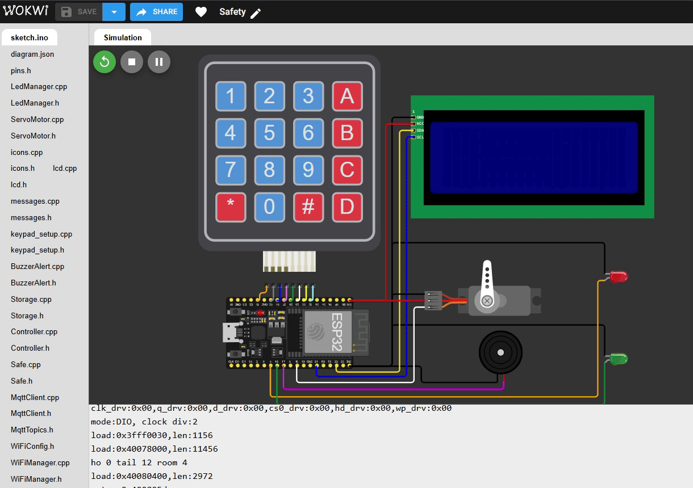
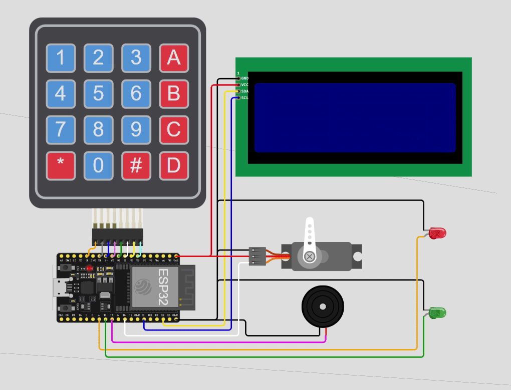
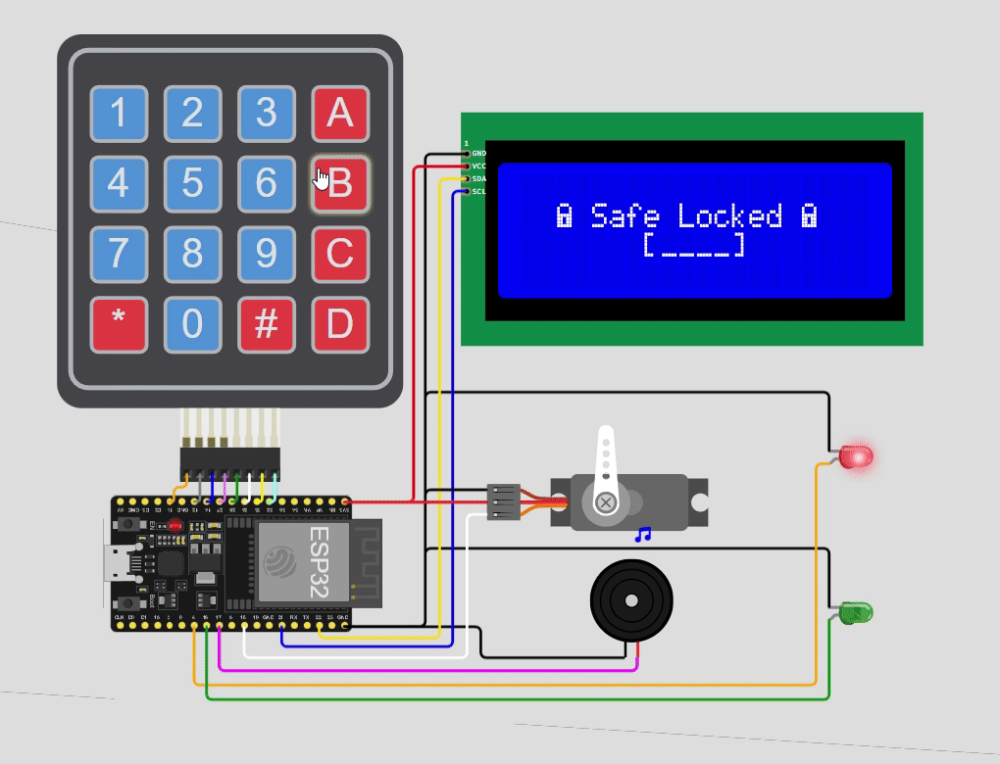
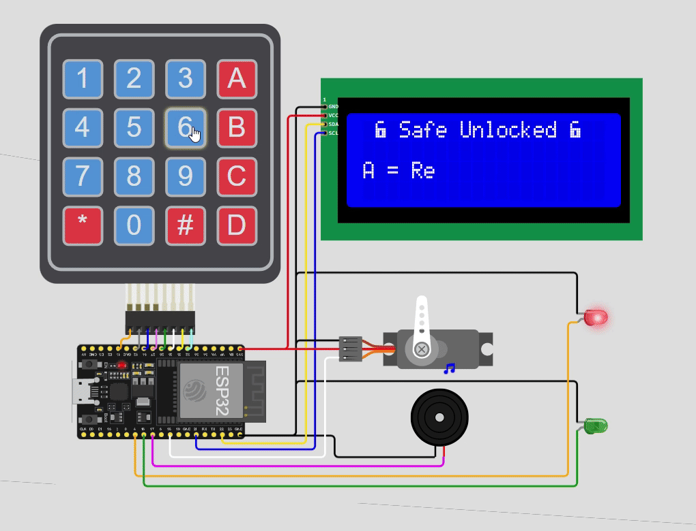
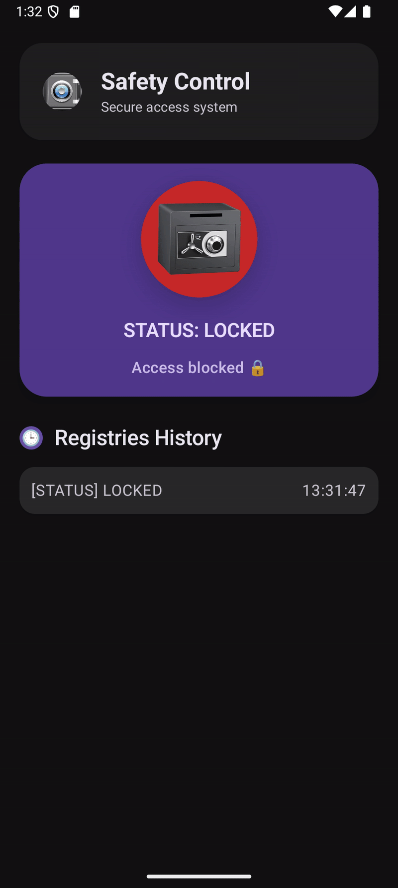
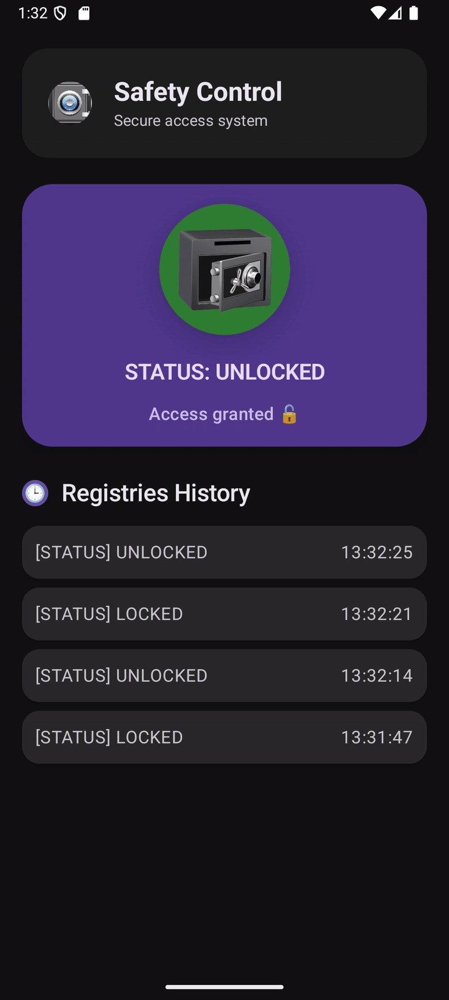

# Safety IoT - Smart Safe System

Safely is a complete IoT smart safe system that integrates an ESP32 (simulated using Wokwi or PlatformIO) with an Android application, communicating through MQTT for real-time monitoring and status synchronization.


## Table of Contents
- [Overview](#overview)
- [System Architecture](#system-architecture)
- [Repository Structure](#repository-structure)
- [Getting Started](#getting-started)
  - [ESP32 Firmware](#firmware-esp32)
  - [Android App](#app-android)
- [Hardware Components](#hardware-components)
- [Features](#features)
- [Functional Flows](#functional-flows)
  - [Firmware (ESP32)](#esp32-firmware)
  - [App (Android)](#android-app)
- [Communication Protocol](#communication)
- [Security Considerations](#security)
- [Technologies](#technologies)
- [Development Workflow](#development-workflow)
- [Troubleshooting](#troubleshooting)
- [Future Improvements](#future-improvements)
- [License](#license)

---

## Overview

**Safety IoT** is a secure smart safe system integrating:

- **ESP32-based IoT device firmware** (PlatformIO/Wokwi)
- **Android mobile app** (Jetpack Compose)

The system allows **real-time monitoring**, secure local access with code entry, and simulation using Wokwi.

---

## System Architecture

```bash
+------------+              +-----------+
|            |              |           |
|   ESP32    |     MQTT     |  ANDROID  |
|  FIRMWARE  | <----------> |    APP    |
|            |              |           |
+------------+              +-----------+
```


**Components**:

- **ESP32 Firmware**: C++ | PlatformIO | Wokwi
- **Android App**: Kotlin | Jetpack Compose | Paho MQTT
- **MQTT Broker**: Public HiveMQ broker for messaging

---


## Repository Structure
````
safety/
│
├── mobile/
│ └── android/ ← Android app submodule
│
├── firmware/
│ └── esp32/ ← ESP32 firmware submodule
│
├── .gitmodules ← Git submodules configuration
└── README.md
````

> Uses **Git Submodules** for modular separation of Android app and ESP32 firmware.

-----


## Getting Started

### Remote

#### Firmware ESP32

1. Open the [project simulation link](https://wokwi.com/projects/450795723160817665) in Wokwi.

2. Run simulation in Wokwi.



3. Configure WiFi config if needed.

4. Configure MQTT config if needed.

5. Monitor serial logs for system feedback.


### Local

Clone repository including submodules:

```bash
git clone --recurse-submodules git@github.com:andersontrkz/safety.git
cd safety
```

#### Firmware ESP32

        1. Open firmware/esp32 in VS Code.

        2. Use PlatformIO and Wokwi tools.

        3. Build & upload to ESP32.

        4. Configure WiFi config if needed.

        5. Configure MQTT config if needed.

        6. Monitor serial logs for system feedback.


#### App Android

        7. Open mobile/android in Android Studio.

        8. Build and run on emulator or physical device.

        9. Configure MQTT config if needed.

        10. The app automatically connects to the MQTT broker and displays safe status.


## Hardware Components

```bash
+----------+         +---------------+
|  Keypad  | ------> |               |
+----------+         |               |
+----------+         |               |
|   LCD    | <------ |               |
+----------+         |               |
+----------+         |               |
|   Servo  | <------ |     ESP32     |
+----------+         |               |
+----------+         |               |
|   LEDs   | <------ |               |
+----------+         |               |
+----------+         |               |
|  Buzzer  | <------ |               |
+----------+         +---------------+

```

|     Component     |        Pin        |
| ----------------- | ----------------- |
| Keypad (R1..R4)   | 13 - 12 - 14 - 27 |
| Keypad (C1..C4)   | 26 - 25 - 33 - 32 |
| LCD (I2C)         | 22 - 21           |
| Servo Motor       | 18                |
| LED (RED)         | 4                 |
| LED (GREEN)       | 16                |
| Buzzer            | 17                |
| ESP32             | MCU               |


## Features

### ESP32 Firmware
- Keypad input handling for code entry
- Servo-controlled lock mechanism
- LED & buzzer hardware feedback
- LCD messages for user interaction
- Code setup and verification logic
- Supports mute/unmute and lock actions
- WiFi connectivity management
- MQTT messaging (`safer/status`)

### Android App
- Displays safe status (locked/unlocked)
- Shows last access events
- Built with Jetpack Compose
- Real-time updates via MQTT (`safer/status`)


## Functional Flows

### ESP32 Flows

All flows below were recorded from the ESP32 simulation, sending events via MQTT.

#### System Startup


*ESP32 boot sequence with LCD animation, buzzer and LEDs feedback, and system initialization.*

#### Set Security Code


*User defines a new 4-digit code using the keypad and confirms it.*

#### Unlock Safe


*Correct code entered → safe unlocks, servo opens, status published via MQTT.*

#### Lock Safe


*Safe is locked again locally and status is updated remotely.*

#### Mute / Unmute Buzzer


*User toggles sound alerts while the keypad is used.*

#### Reset Code


*Existing code is cleared and the system returns to setup mode.*

#### Access Denied


*Incorrect code entered → error feedback via LCD, LEDs, and buzzer.*

#### Code Mismatch


*Code confirmation fails → configuration rejected.*


### Android Flows

All flows below were recorded from the Android simulation, receiving events via MQTT.

|                            Safe Locked                            |                             Safe Unlocked                             |
|-------------------------------------------------------------------|-----------------------------------------------------------------------|
|         |           |
| *Android app shows **`LOCKED`** status until it receives **`UNLOCKED`** status and then logs the event to history.* | *Android app receives status updates and toggles between **`UNLOCKED`**  ↔ **`LOCKED`**, logging all events.* |


## Communication

- MQTT Topic: ``safer/status``
- Payload: ``LOCKED`` or ``UNLOCKED``

*App subscribes to this topic in real-time.*


## Security

- Safe code
    - Storage class in-memory
    - Fixed 4-digit code


## Technologies

This project combines embedded systems, IoT communication, and modern Android development, using industry-relevant tools and frameworks.

### ESP32

The ESP32 is low-power microcontroller with integrated Wi-Fi and Bluetooth, widely used in IoT applications.

[📚 Official ESP32 Documentation](https://www.espressif.com/en/products/socs/esp32)


### Wokwi

Wokwi is an online microcontroller simulator that allows realistic simulation of ESP32 projects without physical hardware.

[📚 Official Wokwi Documentation](https://docs.wokwi.com/)


### PlatformIO

PlatformIO is a professional embedded development ecosystem built on top of VS Code.

[📚 Official PlatformIO Documentation](https://docs.platformio.org/)


### MQTT

MQTT (Message Queuing Telemetry Transport) is a lightweight publish/subscribe messaging protocol designed for IoT systems.

[📚 Official MQTT Documentation](https://mqtt.org/)


### HiveMQ

HiveMQ is a public broker that provides a reliable public MQTT broker suitable for testing and learning.

[📚 Official HiveMQ Documentation](https://www.hivemq.com/public-mqtt-broker/)


### Android

The Android application acts as a remote monitoring interface for the smart safe.

[📚 Official Android Documentation](https://developer.android.com/)


### Jetpack Compose

Jetpack Compose is Android’s modern, declarative UI toolkit.

[📚 Official Jetpack Compose Documentation](https://developer.android.com/jetpack/compose)


## Development Workflow

### ESP32 Firmware changes:

#### ESP32 changes:
```bash
git add .
git commit -m "Feature XYZ"
git push origin feature/xyz
```

#### Update ESP32 submodule in main repo:
```bash
cd ../../
git add firmware/esp32

git commit -m "feat(esp32): update module"
git push
```


### Android app changes:

#### Android changes:
```bash
cd mobile/android

git commit -m "feat(android): update module"
git push
```

#### Update Android submodule in main repo:
```bash
cd ../../
git add mobile/android

git commit -m "feat(android): update module"
git push
```


## Troubleshooting

- WiFi issues
    - Check WiFiConfig.h 
    - Check serial monitor

- MQTT connection failed
    - Check verify broker 
    - Check network

- LCD not displaying
    - Check verify broker 
    - Check network

- LCD not displaying:
    - Check SDA pin
    - Check SCL pin

- Keypad unresponsive:
    - Check keypad setup


## Future Improvements

- Encrypted MQTT communication (TLS)

- App-based unlock with OTP authentication

- Multi-user access logging

- Low-power / battery monitoring

- Safe availability feedback

- ROM-based memory implementation


## License

[](https://choosealicense.com/licenses/mit/)
